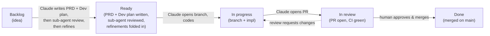

# CLAUDE.md

Entry point for any Claude session in this repo. Read once, then act.

## Brevity contract

Every line in this file costs context for every future session. **If you (Claude) already understand a convention, don't expand on it; if you've seen a project pattern five times this session, don't restate it back.** Keep PR bodies, commit messages, and issue updates tight — say what changed, why it matters, and how it was tested. Cut everything else.

When updating this file: prefer fewer words, bullet points over prose, and a single canonical statement of each rule. Do not duplicate what's already in `docs/`.

## 1. Mission

A growing collection of **classic games** for **web / Android / iOS / desktop**, with **first-class gamepad support**. First game: **Tetris**.

## 2. Stack

- **Engine**: Godot 4.6 standard (GDScript). Not the .NET build.
- **Tests**: GUT, vendored at `godot/addons/gut/`.
- **CI**: GitHub Actions, headless Godot.
- **Deploy**: Web (gh-pages) → Android APK artifact → Windows zip → iOS (deferred).

Rationale for Godot over Flutter / Unity / web-only: see `docs/architecture.md`.

## 3. Layout

```
godot/                  Godot project root
  globals/              Autoloads (GameInfo, InputManager, …)
  scenes/{menu,<game>}/
  scripts/
    core/               Cross-game shared utilities
    <game>/core/        Per-game PURE logic (no Node, no OS calls) — unit-testable
  assets/               Art, audio, fonts
  addons/gut/           Vendored test framework
  tests/{unit,integration}/
docs/                   architecture, input-mapping, adding-a-game
.github/                workflows, issue & PR templates
scripts/board.sh        Move a Project board card by issue number
```

## 4. Run / test / export

```bash
godot --path godot                                                    # play
godot --headless --path godot -s addons/gut/gut_cmdln.gd \            # test
  -gconfig=res://.gutconfig.json
godot --headless --path godot --export-release "Web" build/web/index.html
```

CI must be green before merge. Same command runs there.

## 5. Process

### Issues + PRs

- Every change starts as a GitHub issue. Issues live on Project #5: <https://github.com/users/lubobill1990/projects/5/views/1>.
- Tasks are **linear**. One issue → one PR → merge → next.
- Branch name: `task/NN-<slug>`.
- PR body: link the issue (`Closes #N`) + "How tested" section.

### Task status workflow



| State | What it means |
|---|---|
| **Backlog** | Issue exists, no PRD/plan yet. |
| **Ready** | PRD + Dev plan written *and* refined after a sub-agent review. Sittable on the shelf, fully scoped. |
| **In progress** | Branch exists, code being written. |
| **In review** | PR open, CI green, awaiting human. |
| **Done** | Merged on `main`, CI green on `main`. |

**Hard rules** (Claude must obey, automatically):

1. **Move the card immediately on every transition.** Use `scripts/board.sh <issue> <Backlog|Ready|InProgress|InReview|Done>`. Don't batch.
2. **Backlog → Ready requires sub-agent review.** Write PRD + Dev plan into the issue body, then spawn a sub-agent (`Plan` or `general-purpose`) to critique both, then fold the feedback in. Only then move to Ready.
3. **No PR while in Backlog or Ready.** Move to In progress first.
4. **Done = merged on `main` + CI green on `main`.** Not "approved", not "branch ready".
5. **Review requests changes → back to In progress.**
6. **Abandoned task → close issue with reason; don't strand the card.**

#### PRD vs. Dev plan

Both go in the issue body, in labeled sections.

- **PRD** — *what & why*. Problem, goal, scope, non-goals, acceptance criteria.
- **Dev plan** — *how*. Files to add/modify, public APIs, test strategy, risks, commit sequence inside the PR.

Sub-agent's job: poke holes in scope, sequencing, missing edge cases, simpler alternatives.

### Commits

Conventional-ish: `feat: …`, `fix: …`, `test: …`, `chore: …`, `docs: …`, `refactor: …`, `ci: …`. Reference issue when relevant.

### Code style

- GDScript, **statically typed** (`var x: int`, `-> void`).
- Tabs (Godot default).
- Per-game `core/` must not import `Node` or call OS/Engine APIs. This is the testability contract.
- Per-game `core/` exposes state via `snapshot() -> Dictionary` (with `version: int`); never via signals. Scenes diff snapshots. See `docs/persistence.md` for the persistence key namespace and schema policy.

### Tests — three layers, all required

1. **Unit** — pure logic. `tests/unit/`.
2. **Scene** — input → core → render. Use `Input.parse_input_event`.
3. **Integration** — scripted, deterministic-seed sessions. `tests/integration/`.

## 6. Adding a new game

See `docs/adding-a-game.md`.

## 7. Don'ts

- No Flutter / Unity / React Native — Godot is the decision.
- No C#/.NET Godot.
- Don't commit `.godot/` cache or build output (gitignored).
- Don't open a PR without a backing issue.
- Don't mark a card Done with red CI.
